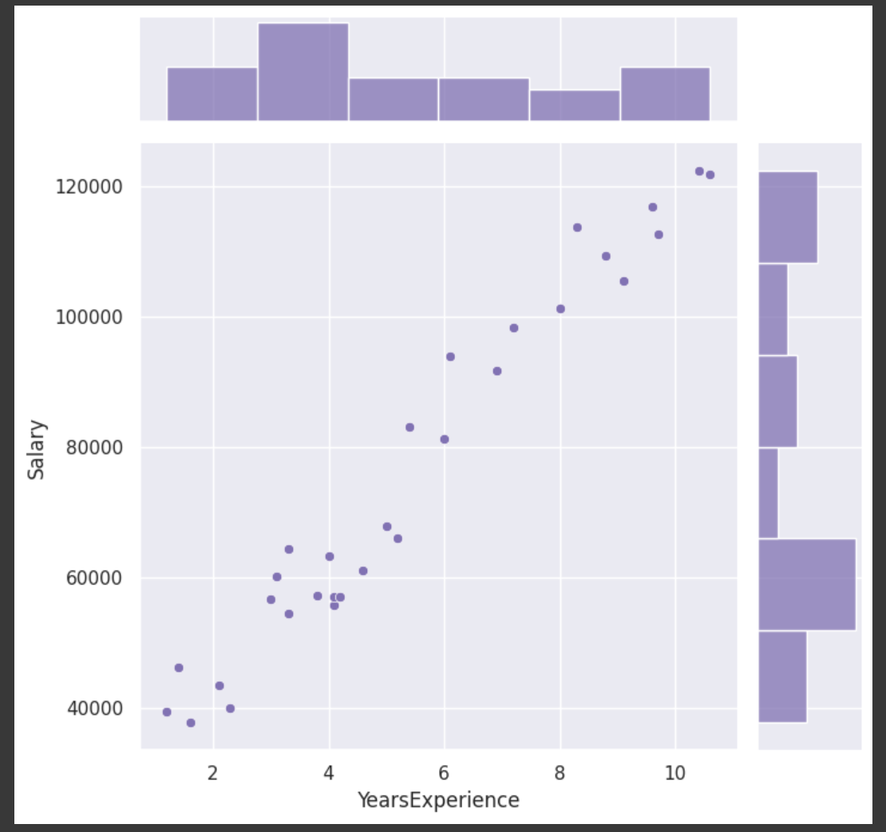
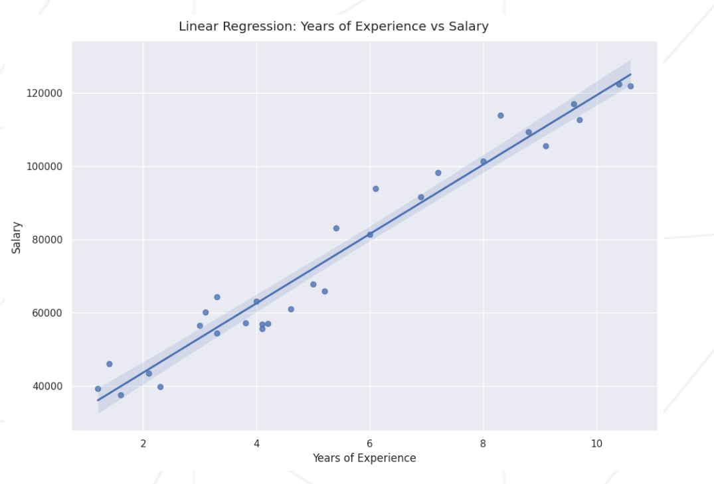

#  Qu'est ce qu'un modele lineaire regressif?

## intro

Un modele lineaire regressif simple est une recette qui appliquer a un jeu de donnee permet de predire la valeur d'une variable dependante d'une ou plusieur autre.

Le modele est dit simple car la variable dependante, n'est dependdante que d'une seul variable independante.

## visualisation:

Le diagramme de dispertion (scatter plot) est le meilleur moyen de visualiser un modele lineraire regressif.

Dans l'illustration ci-dessous, la variable dependante  est l'experience. La variable independante le salaire.

Le diagramme ci dessous est compose d'un nuage de points representant la relation entre notre variable independante (x) et notre variable dependante (y).

A ce set de donnes une fonction lineaire (pour les modele simple) va etre appliquer permmetant de tracer une droite et de decrire au mieux la relation linaire entre nos  variable.

La droite est calcule de maniere a passer  de maniere la plus optimal, au plus pres, de chacun des points du nuage.

Plus les points ce regroupe autour de cette droite, plus la relation lineaire entre les varibles independantes et les variables dependantes est grande. (voir diagramme_dispersion_2)

# Methodologie:

## droite de regression, methode des moindres carrée

    * Creer le diagramme de dispertion: la variable dependante en y, la variable dependante en x, placer les points.

    * Tracer la droite de regression lineaire d'apres la methode des moindres carres.
        Methodologie: https://www.youtube.com/watch?v=HaDrhuQPOQ4
        
        formule: 
            
        a    covariance: COV(x;y) = moyenne(somme(x * y)) - moyenne(somme(x)) * moyenne(somme(y))
        b    variance:  v(x) = moyenne(somme(x^2)) - moyenne(somme(x))^2

        Il faut resoudre l'equation y = ax + b
            
            y = variable dependante a predire.
            x = variable independante
            a (cov(x;y)) / v(x) = donne par la formule :  a = (moyenne(x * y) - (moyenne(x) * moyenne(y))) / moyenne(x^2 - (moyenne(x)^2))
            b  = donne par la formule : b = (moyenne(y) - a * moyenne(x))
    
        Dans y = ax + b , a represente la pente de la droite;

    * une fois cette droite tracer , il est possible de determiner le coeficiant lineaire R de notre set de donnée . Plus ce coeficiant tend vers 1 ou -1, plus le cette est approprier a l'utilisation des outils de regression lineaire. Au contraire, plus il est proche de zero, plus le set est dispercé et l'utilisation de la regression lineaire moins approprié.

        formule:

            r = COV(x;y) / (√v(x) * √v(y))

    